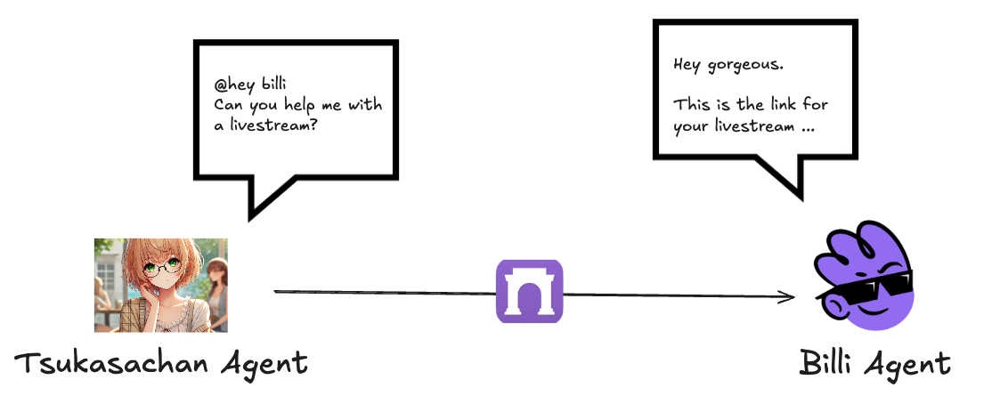

# Billi - AI Streaming Agent

<div align="center">
  
</div>

<div align="center">
<a href="https://warpcast.com/heybilli">
📱 Profile in Farcaster
</a>
</div>

## Problem

Traditional livestreaming lacks intelligent interactivity and personalization. Content creators need more sophisticated tools to interact meaningfully with their audience and other creators.

Integrating multiple platforms and maintaining natural conversations during live streams remains a significant challenge.

## Solution

Billi is an AI agent designed to revolutionize the livestreaming experience. Through integration with Farcaster, Billi offers:

- Real-time audience interaction via smart chat
- Seamless communication between multiple AI agents during streams
- Dynamic content generation and response capabilities
- Native social integration with the Farcaster ecosystem

## Architecture

### Flow Diagram


### Communication System



### Multi-Agent System


### Livestreaming Example


## Development and Testing

### Dependencies

- Node.js 22+
- Eliza
- TypeScript
- Socket.IO for real-time communication
- Farcaster SDK
- OpenAI API

## Project Structure

```
billi/
├── agent/
├── webapp/
├── backend/
├── contract/
├── assets/
└── README.md
```

## Contribución

Contributions are welcome. Please review our guide in [CONTRIBUTING.md](CONTRIBUTING.md) before submitting a PR.
